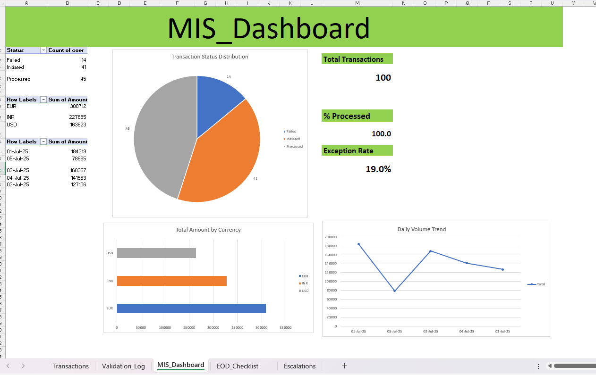
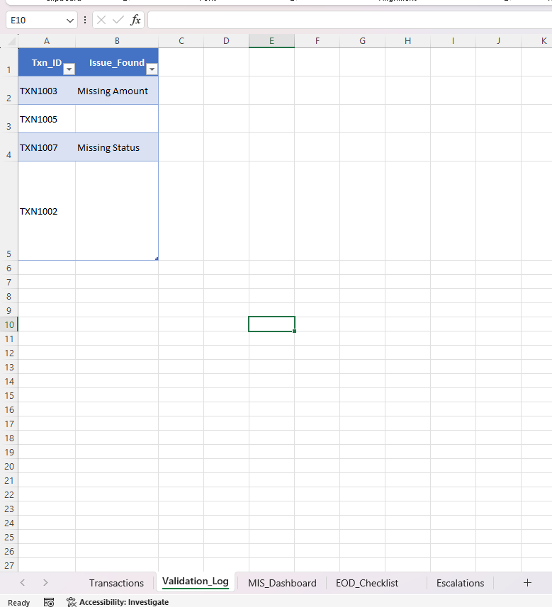

# 💳 Payment Processing Simulation – Excel Dashboard Project

A real-world-modeled simulation of a daily payment processing tracker built in Microsoft Excel. This project demonstrates how payment analysts or financial operations teams monitor transactions, validate data, track exceptions, and report KPIs via an interactive dashboard.

---

## 🧩 Project Overview

This project mimics a typical payment operations workflow in a bank or fintech setup. It covers the full cycle from raw transaction entry to issue validation, KPI calculation, and dashboard reporting — built entirely in Excel.

---

## 📋 Features

- ✅ **Transactions Sheet**: Simulated 10-entry payment log with blanks, errors, and mixed status values  
- ⚠️ **Validation_Log**: Automatically flags missing amounts, negative values, or unverified processed transactions  
- 📊 **MIS_Dashboard**:
  - Pivot Table summaries for status, currency, and date trends  
  - Charts: Pie (status split), Bar (currency volume), Line (daily trend)  
  - KPI block: Total Transactions, % Processed, Exception Rate  
- 📌 **EOD_Checklist**: End-of-day operational checklist (✔/✘ dropdown)  
- 🚨 **Escalations**: Log of manual issues flagged for further action  

---

## 🛠 Tools & Techniques

- Microsoft Excel (no macros)  
- PivotTables  
- Data Validation  
- Conditional Formatting  
- Charting (Pie, Bar, Line)  
- Percentage KPI calculations  
- Table-based layouts  

---

## 📸 Screenshots

### 🧾 Dashboard Overview

### 📋 EOD Checklist Sheet

### ⚠️ Validation Log Sheet

---

## 🎯 Why This Project Matters

This simulation helps demonstrate:
- Accuracy and exception handling in daily finance workflows  
- MIS reporting skills using Excel  
- Dashboard building without VBA  
- Real-world understanding of audit-readiness and operations control  

---

## 📂 Files Included

| File Name                                               | Description                          |
|----------------------------------------------------------|--------------------------------------|
| `Payment Processing Simulation – Excel Dashboard Project.xlsx` | Main Excel dashboard project   |
| `dashboard-overview.png`                                | Overview of full dashboard layout    |
| `EOD Checklist Sheet.png`                               | End-of-day checklist view            |
| `validation-log.png`                                    | Error validation output table        |

---

## 📬 Contact

Connect with me on [LinkedIn](https://www.linkedin.com/in/rajathesh-hm)  
Let’s collaborate on Excel-based operations, compliance, or dashboard automation projects.
